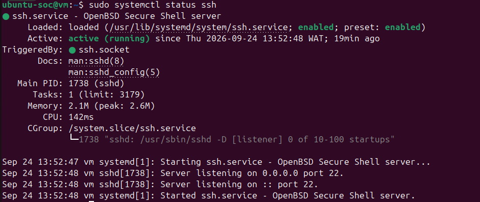
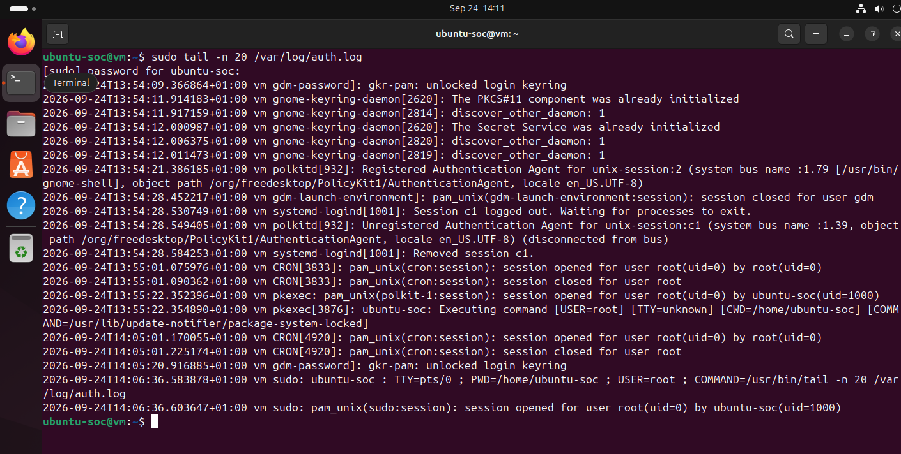
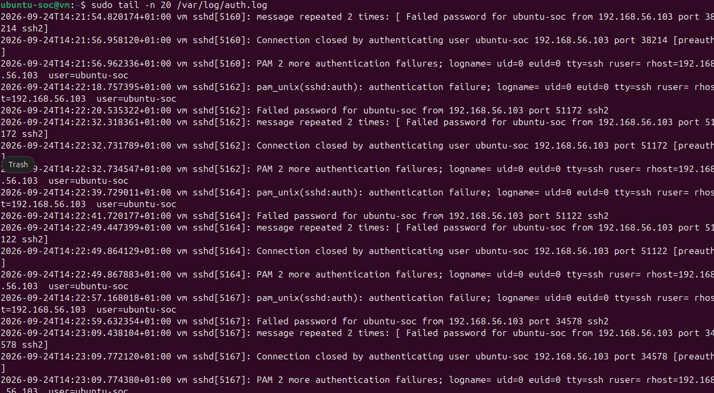
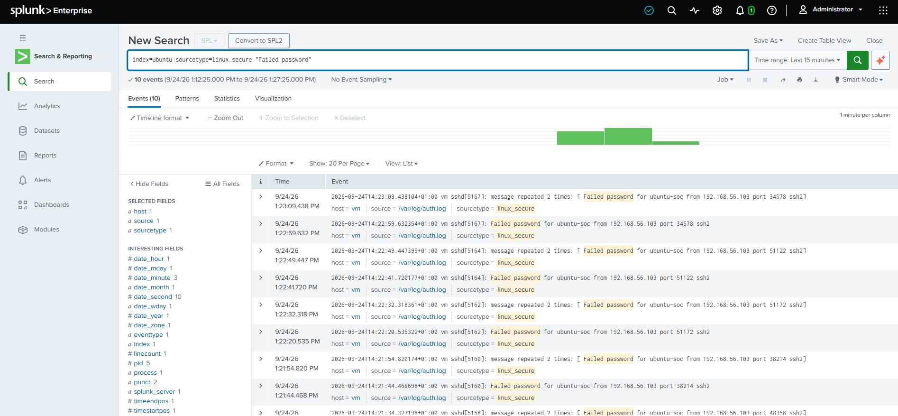
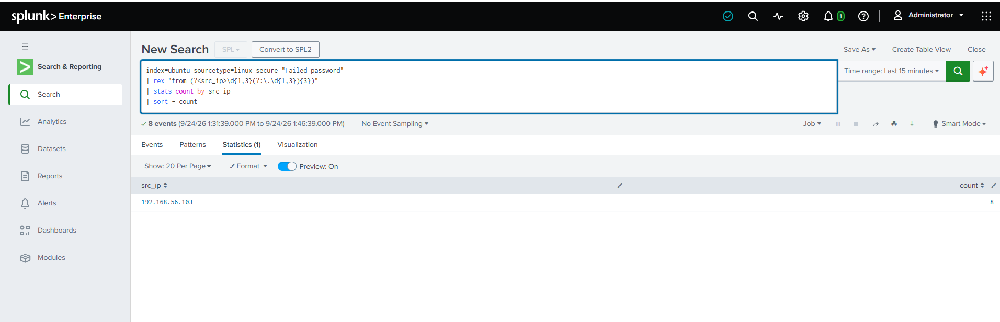
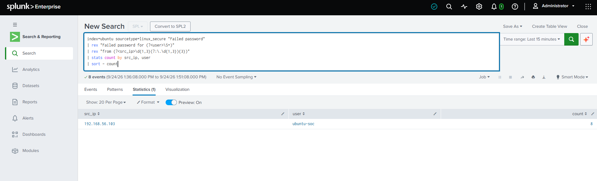
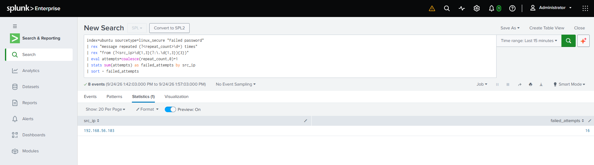
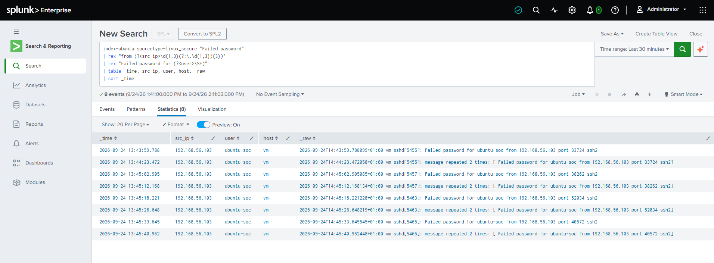
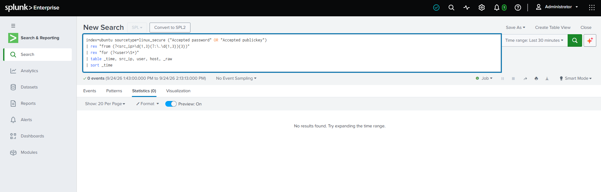
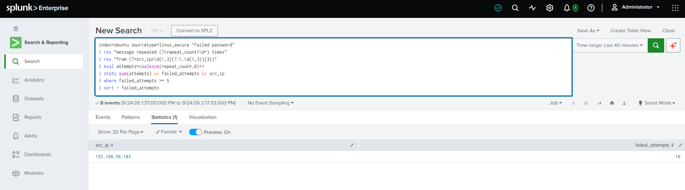

# Project 01 — SSH Brute-Force Investigation with Splunk

## Overview

This project demonstrates a SOC investigation into repeated SSH authentication failures against an Ubuntu server.

A controlled authentication attack was generated from a Kali Linux host against an Ubuntu server. The resulting SSH authentication logs were forwarded to Splunk Enterprise, where SPL was used to identify the source IP, targeted account, authentication activity, and potential successful authentication.

The investigation also demonstrates how repeated SSH messages can be aggregated by the Linux logging system, requiring the analyst to account for repeated messages when calculating the number of authentication attempts.

## Scenario

A SOC analyst receives telemetry indicating repeated SSH authentication failures against an Ubuntu server.

The objective of the investigation is to determine:

- The source of the authentication activity
- The account being targeted
- The number of failed authentication attempts
- The timeline of the activity
- Whether a successful SSH authentication occurred
- How the activity could be detected using Splunk

## Lab Environment

| Component | Role | IP Address |
|---|---|---|
| Kali Linux | Attack simulation host | `192.168.56.103` |
| Ubuntu Server | Target / log source | `192.168.56.102` |
| Splunk Enterprise | SIEM | `192.168.56.105` |

### Data Flow

```text
Kali Linux (192.168.56.103)
        │  SSH authentication attempts
        ▼
Ubuntu Server (192.168.56.102)
        │  /var/log/auth.log
        ▼
Splunk Universal Forwarder
        │  TCP 9997
        ▼
Splunk Enterprise (192.168.56.105)
        │
        ▼
SPL Investigation
```

## Investigation Objectives

- Which source IP generated the failed SSH authentication activity?
- Which account was targeted?
- How many authentication failures occurred?
- When did the activity occur?
- Was a successful SSH authentication observed?
- Can the activity be converted into a reusable Splunk detection?

## 1. Establishing the Baseline

The Ubuntu server's SSH service and authentication log were checked before the controlled simulation, to confirm the target was reachable and to establish a clean baseline.

`sshd` confirmed active and listening:



`/var/log/auth.log` before the simulation, showing normal session activity with no SSH authentication failures:



A clean baseline allowed the events generated during the controlled simulation to be identified more clearly.

## 2. Controlled Attack Simulation

SSH authentication attempts were generated from the Kali Linux host (`192.168.56.103`) against the Ubuntu server (`192.168.56.102`), intentionally using incorrect credentials to generate failed SSH authentication events.

The Ubuntu server recorded the activity in `/var/log/auth.log`:



## 3. Splunk Data Validation

The authentication events were searched in Splunk using:

```spl
index=ubuntu sourcetype=linux_secure "Failed password"
```

The events were successfully received by Splunk through the configured Universal Forwarder pipeline.



The relevant event characteristics:

- **Index:** `ubuntu`
- **Sourcetype:** `linux_secure`
- **Source:** `/var/log/auth.log`

## 4. Source IP Investigation

The initial attempt to use:

```spl
index=ubuntu sourcetype=linux_secure "Failed password"
| stats count by src_ip
| sort - count
```

returned no results because `src_ip` was not automatically extracted from the raw event. The raw event contained the source IP in the following format:

```text
Failed password for ubuntu-soc from 192.168.56.103
```

A `rex` extraction was therefore used:

```spl
index=ubuntu sourcetype=linux_secure "Failed password"
| rex "from (?<src_ip>\d{1,3}(?:\.\d{1,3}){3})"
| stats count by src_ip
| sort - count
```



**Result:** the source IP identified during the investigation was `192.168.56.103`, corresponding to the Kali Linux host used for the controlled simulation.

## 5. Target Account Investigation

The targeted username was extracted alongside the source IP:

```spl
index=ubuntu sourcetype=linux_secure "Failed password"
| rex "Failed password for (?<user>\S+)"
| rex "from (?<src_ip>\d{1,3}(?:\.\d{1,3}){3})"
| stats count by src_ip, user
| sort - count
```



**Result:**
- **Source IP:** `192.168.56.103`
- **Target account:** `ubuntu-soc`

This established the relationship between the source of the activity and the targeted account.

## 6. Failed Authentication Count

The investigation returned 8 Splunk events containing failed authentication activity. However, inspection of the raw events showed that Linux SSH logging can aggregate repeated authentication messages into a single event using a format such as `message repeated 2 times`. Therefore, event count alone did not represent the total number of authentication attempts.

The following SPL was used to account for the repeated messages:

```spl
index=ubuntu sourcetype=linux_secure "Failed password"
| rex "message repeated (?<repeat_count>\d+) times"
| rex "from (?<src_ip>\d{1,3}(?:\.\d{1,3}){3})"
| eval attempts=coalesce(repeat_count,0)+1
| stats sum(attempts) as failed_attempts by src_ip
| sort - failed_attempts
```



**Result:**
- **Source IP:** `192.168.56.103`
- **Failed attempts:** `16`

### Investigation Note

The difference between the number of Splunk events and calculated authentication attempts is important:

```text
8 Splunk events → repeated-message indicators → 16 calculated failed attempts
```

This demonstrates why SOC analysts should understand the structure and behavior of the underlying log source before interpreting event counts.

## 7. Authentication Timeline

The events were placed into chronological order using:

```spl
index=ubuntu sourcetype=linux_secure "Failed password"
| rex "from (?<src_ip>\d{1,3}(?:\.\d{1,3}){3})"
| rex "Failed password for (?<user>\S+)"
| table _time, src_ip, user, host, _raw
| sort _time
```



The search returned 8 logged events, representing the authentication activity recorded by the Linux logging system. Because repeated authentication messages could be aggregated, the number of timeline rows did not correspond directly to the calculated number of authentication attempts.

## 8. Successful Authentication Check

The next investigative question was whether the source IP subsequently achieved a successful SSH authentication:

```spl
index=ubuntu sourcetype=linux_secure ("Accepted password" OR "Accepted publickey")
| rex "from (?<src_ip>\d{1,3}(?:\.\d{1,3}){3})"
| rex "for (?<user>\S+)"
| table _time, src_ip, user, host, _raw
| sort _time
```



**Result:** no results were returned during the investigated time window. No successful SSH authentication event was observed — this investigation does not establish that the targeted account was successfully compromised.

## 9. Detection Logic

The investigation was converted into a basic Splunk detection for repeated failed SSH authentication attempts:

```spl
index=ubuntu sourcetype=linux_secure "Failed password"
| rex "message repeated (?<repeat_count>\d+) times"
| rex "from (?<src_ip>\d{1,3}(?:\.\d{1,3}){3})"
| eval attempts=coalesce(repeat_count,0)+1
| stats sum(attempts) as failed_attempts by src_ip
| where failed_attempts >= 5
| sort - failed_attempts
```



The query:

- Searches Linux authentication events
- Identifies failed SSH authentication
- Extracts the source IP
- Accounts for repeated messages
- Calculates failed attempts
- Groups activity by source IP
- Returns sources with at least five failed attempts

For this lab simulation, the detection identified: `192.168.56.103 → 16 failed attempts`

## 10. MITRE ATT&CK Mapping

**T1110 — Brute Force**

The activity simulated repeated authentication attempts against an SSH service. The investigation focused specifically on failed authentication attempts rather than establishing successful account compromise.

## 11. Investigation Findings

| Investigation Question | Finding |
|---|---|
| Source IP | `192.168.56.103` |
| Target | Ubuntu server `192.168.56.102` |
| Targeted account | `ubuntu-soc` |
| Splunk events | 8 |
| Calculated failed attempts | 16 |
| Successful SSH authentication observed | No |
| Log source | `/var/log/auth.log` |
| Splunk index | `ubuntu` |
| Sourcetype | `linux_secure` |

### Summary

The investigation identified repeated SSH authentication failures originating from the Kali Linux host at `192.168.56.103` and targeting the `ubuntu-soc` account on the Ubuntu server.

Eight authentication events were ingested into Splunk. Due to repeated-message aggregation in the Linux authentication logs, these events represented 16 calculated failed authentication attempts.

A search for successful SSH authentication events returned no results during the investigated time window.

The activity was subsequently converted into a basic Splunk detection that identifies source IPs associated with five or more calculated failed authentication attempts.

## 12. Lessons Learned

**1. Event count does not always equal activity count**
Linux authentication logging can aggregate repeated messages, so analysts need to inspect the raw event before interpreting event counts.

**2. Fields may require extraction**
The source IP was present in the raw event but was not available as the expected `src_ip` field. SPL `rex` was used to extract the value.

**3. Investigation should progress from raw telemetry**

```text
Raw event → Source identification → Target account → Attempt count
→ Timeline → Successful authentication check → Detection logic
```

**4. Absence of evidence should be documented**
The investigation did not identify a successful SSH authentication event. Rather than assuming compromise, the result was documented as no successful authentication observed within the investigated time window.

## 13. Screenshots

```text
screenshots/
├── 01-ubuntu-host.png
├── 02-auth-log-baseline.png
├── 03-ssh-attack-evidence.png
├── 04-splunk-auth-events.png
├── 05a-source-ip.png
├── 05b-target-account.png
├── 05c-failed-attempt-count.png
├── 06-authentication-timeline.png
├── 07-successful-auth-check.png
└── 08-brute-force-detection.png
```

Each screenshot provides supporting evidence for a specific stage of the investigation.

## Conclusion

This project demonstrated a complete authentication-focused SOC investigation using Splunk. The investigation moved from endpoint telemetry to SIEM analysis, identified the source and targeted account, accounted for aggregated authentication messages, established the number of failed attempts, checked for successful authentication, and converted the findings into a reusable detection query.

The exercise also highlighted an important practical SOC skill: understanding the underlying log format before interpreting SIEM results.
