# Project 02 — PowerShell Detection & Endpoint Investigation

## Overview

This project demonstrates a controlled Windows endpoint investigation using **Splunk Enterprise** and **Sysmon** telemetry.

A PowerShell-based simulator (`Project02-Simulator.ps1`) was executed twice on the lab endpoint, generating controlled activity representing:

- System, process, and service discovery (`Get-ComputerInfo`, `Get-Process`, `Get-Service`)
- Network configuration and user/host discovery (`ipconfig /renew`, `whoami`, `hostname`)
- Encoded PowerShell execution (`-EncodedCommand`)
- PowerShell spawning a child `cmd.exe` process

The objective was to collect this endpoint telemetry in Splunk, develop focused SPL detections, reconstruct the activity timeline, and investigate parent-child process relationships — including catching discovery behavior the initial detection queries missed.

> **Lab note:** All activity in this project was intentionally generated inside an isolated cybersecurity lab. The simulated commands were designed for detection and investigation practice.

---

## Investigation Objective

Determine whether the simulated PowerShell activity could be identified and investigated using Sysmon process-creation telemetry ingested into Splunk.

The investigation focused on:

1. Identifying PowerShell execution.
2. Detecting `-EncodedCommand`.
3. Identifying PowerShell discovery activity.
4. Investigating parent-child process relationships.
5. Building a chronological activity timeline.
6. Mapping the observed behavior to MITRE ATT&CK.

---

## Lab Environment

| Component | Role |
|---|---|
| Splunk Enterprise | SIEM / log analysis |
| Windows 10 | Investigated endpoint |
| Sysmon | Endpoint process telemetry |
| PowerShell | Simulated activity |
| Host | `DESKTOP-TEDQ8NH` |
| User | `DESKTOP-TEDQ8NH\SOC` |

---

## Attack / Simulation Flow

The controlled simulation was run twice (approximately 13:34–13:35 and 13:45–13:47 UTC) and produced the following activity each time:

```text
powershell.exe -ExecutionPolicy Bypass -File C:\SOC-Lab\Project02-Simulator.ps1
   |
   +-- Get-ComputerInfo      (System Information Discovery)
   +-- Get-Process           (Process Discovery)
   +-- Get-Service           (Service Discovery)
   +-- ipconfig /renew       (Network Configuration Discovery)
   +-- whoami                (System Owner/User Discovery)
   +-- hostname               (System Information Discovery)
   +-- Encoded PowerShell    (-EncodedCommand)
   +-- cmd.exe               (/c echo SOC-LAB-CHILD-PROCESS)
```

The purpose was not to reproduce a real intrusion, but to create realistic endpoint telemetry that could be investigated in Splunk. The discovery, encoded-command, and parent-child relationships were the intended focus — `conhost.exe`, which appeared as a child of the session, is normal console-host behavior rather than a simulated action and was excluded from detection logic.

---

## Evidence Collection

### Sysmon Event ID 1 — System Owner/User Discovery (`whoami`)

Sysmon recorded `whoami.exe` launched directly by the simulator's PowerShell session:

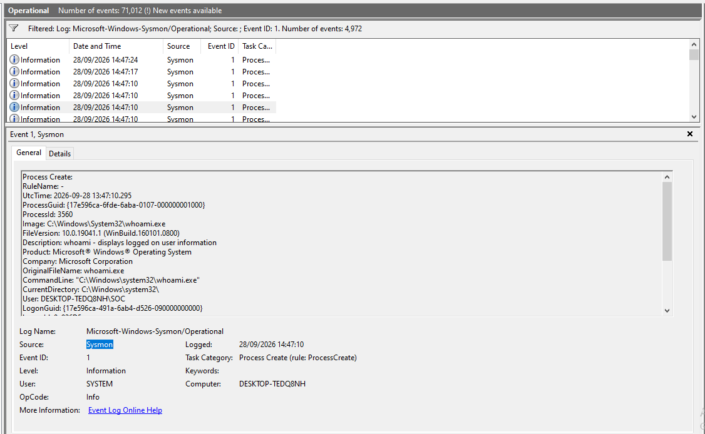

- Process ID: `3560`
- Parent Process ID: `8400`
- Parent Image: `powershell.exe`

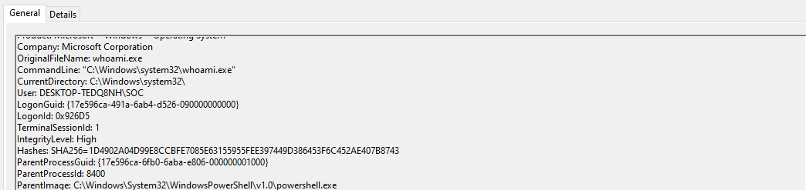

### Sysmon Event ID 1 — Encoded PowerShell

Sysmon recorded a PowerShell process containing `-NoProfile -EncodedCommand ...`:

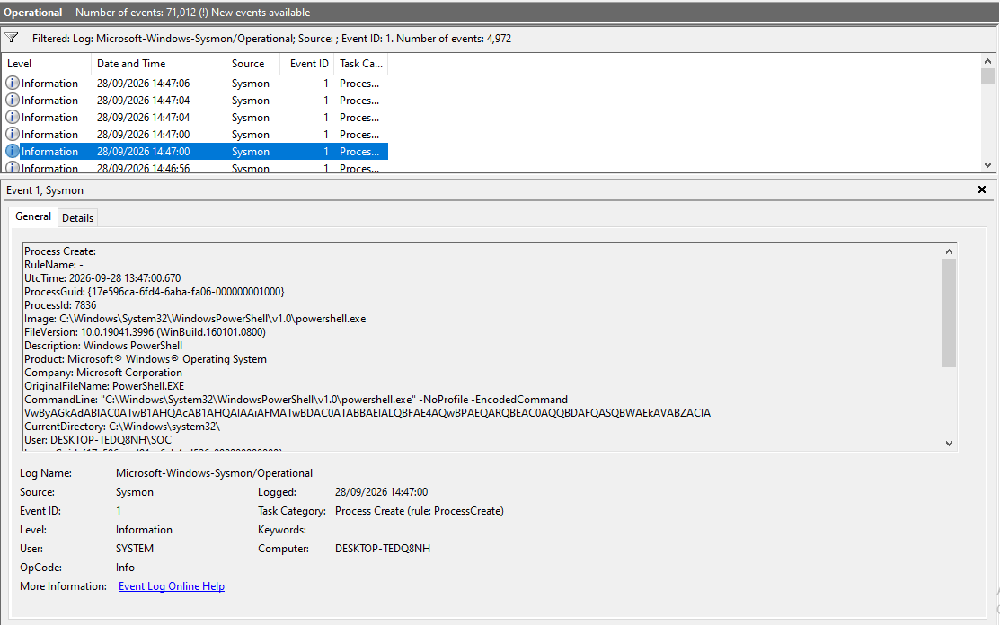

Scrolling the same event further shows the process ancestry — the encoded PowerShell process was itself a child of the PowerShell session that launched the simulator script:

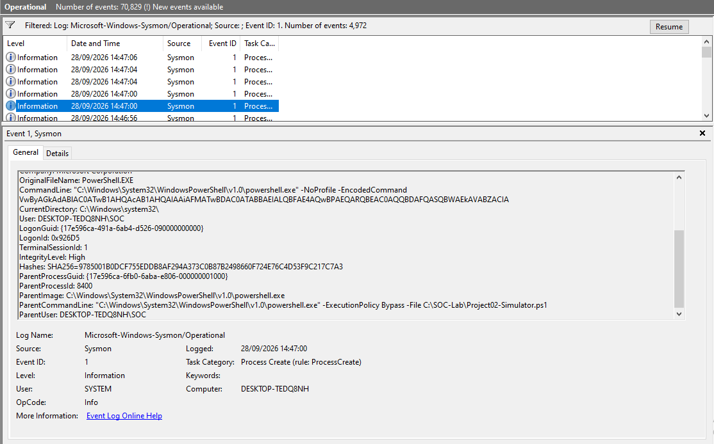

- Process ID: `7836`
- Parent Process ID: `8400`
- Parent Image: `powershell.exe`
- Parent Command Line: `powershell.exe -ExecutionPolicy Bypass -File C:\SOC-Lab\Project02-Simulator.ps1`
- Integrity Level: `High`

The encoded command used by the simulator decoded to a benign lab marker (`Write-Output "SOC-LAB-ENCODED-ACTIVITY"`). This is an important distinction: **encoded PowerShell is an investigation signal, not proof of malicious activity.**

### Sysmon Event ID 1 — PowerShell → CMD

The simulator also generated a `cmd.exe` child process via `Start-Process`:

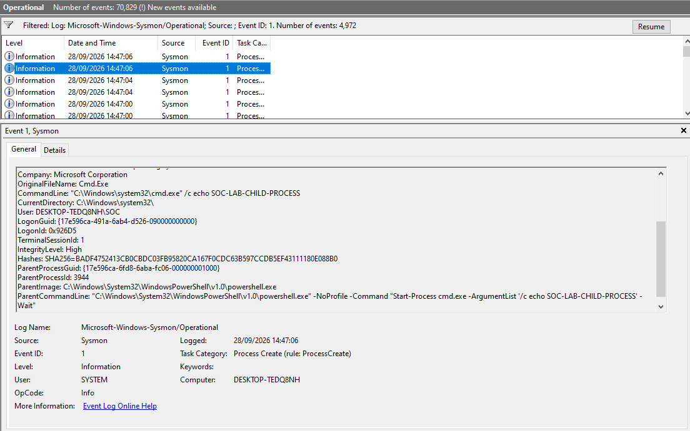

- Image: `C:\Windows\System32\cmd.exe`
- Parent Image: `C:\Windows\System32\WindowsPowerShell\v1.0\powershell.exe`
- Command: `cmd.exe /c echo SOC-LAB-CHILD-PROCESS`

This provided parent-child process telemetry for the investigation.

---

## Splunk Detection Queries

### 1. Host Process Inventory

Used to establish what processes were present on the Windows endpoint:

```spl
index=* EventCode=1 host="DESKTOP-TEDQ8NH"
| stats count by Image
| sort - count
```

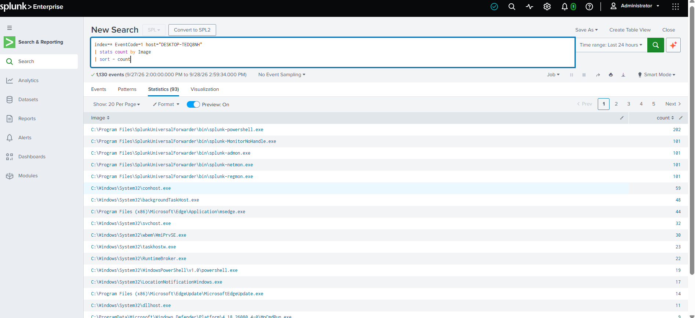

This surfaced the endpoint's full process mix — including the Universal Forwarder's own helper processes (`splunk-powershell.exe`, `splunk-admon.exe`, etc.), which are expected noise from the forwarder itself rather than investigation-relevant activity — alongside `powershell.exe` and other standard Windows processes.

### 2. PowerShell Activity — Raw Exploration

Before building a classification query, the raw PowerShell process-creation events were reviewed directly:

```spl
index=* EventCode=1 host="DESKTOP-TEDQ8NH" Image="*\\powershell.exe"
| table _time User Image CommandLine ParentImage ParentCommandLine ProcessId ParentProcessId
| sort _time
```

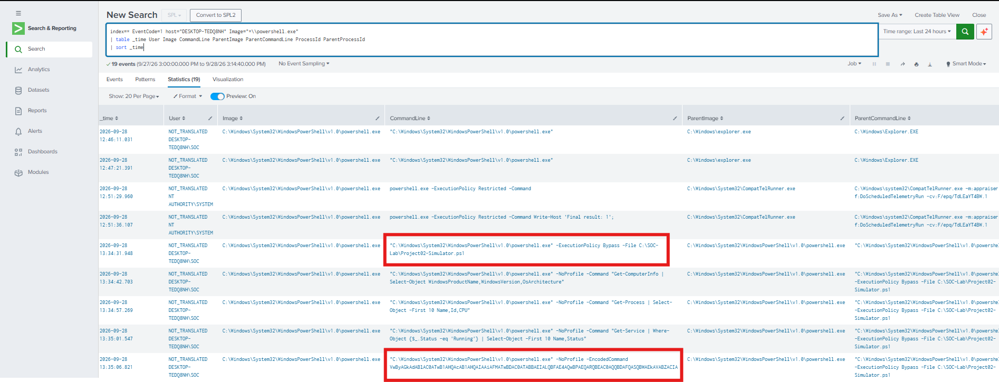

This 19-event raw view is what made the simulator's own launch command (`-File C:\SOC-Lab\Project02-Simulator.ps1`) and the encoded command visible before they were turned into a reusable classification.

### 3. PowerShell Activity — Classification

```spl
index=* EventCode=1 host="DESKTOP-TEDQ8NH" Image="*\\powershell.exe"
| eval Activity=case(
    match(CommandLine,"-EncodedCommand"),"Encoded PowerShell",
    match(CommandLine,"-ExecutionPolicy Bypass"),"Execution Policy Bypass",
    match(CommandLine,"Project02-Simulator.ps1"),"Simulator Execution",
    true(),"Other PowerShell"
)
| table _time Activity User ProcessId ParentProcessId
| sort _time
```

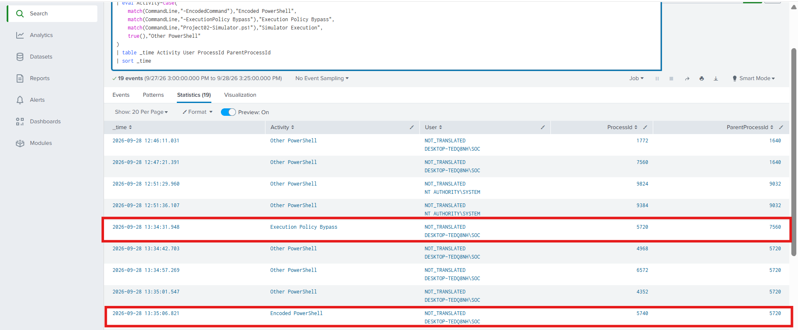

This produced a compact investigation view without relying on a very wide raw-event table.

### 4. Encoded PowerShell — Event Correlation

A single row from the classified table was cross-checked against the Sysmon event viewed directly on the endpoint, confirming the same process (PID `7836`, parent PID `8400`) was visible both at the source and in Splunk:

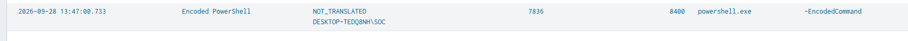

### 5. Encoded PowerShell Detection

```spl
index=* EventCode=1 host="DESKTOP-TEDQ8NH" Image="*\\powershell.exe" CommandLine="*-EncodedCommand*"
| stats count min(_time) as first_seen max(_time) as last_seen by host User Image
| convert ctime(first_seen) ctime(last_seen)
| sort - count
```

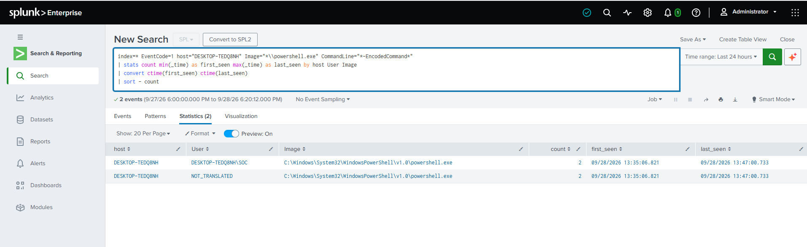

The two simulator runs produced two encoded PowerShell executions (13:35:06 and 13:47:00). The `stats` grouping returned two rows rather than one, because the same pair of events appeared under two different `User` representations — `DESKTOP-TEDQ8NH\SOC` and `NOT_TRANSLATED` — each reporting the same `first_seen`/`last_seen` window. This reflects inconsistent User-field resolution between how the two events were logged, not four separate executions. A production version of this detection should normalize the `User` field (or group on a more reliable identifier) before alerting at scale.

### Detection rationale

`-EncodedCommand` can obscure the command being executed and therefore warrants investigation. However, the indicator should be correlated with:

- Parent process
- User
- Host
- Command context
- Process ancestry
- Surrounding activity

It should not be treated as an automatic malicious verdict.

### 6. PowerShell Discovery Detection

```spl
index=* EventCode=1 host="DESKTOP-TEDQ8NH" Image="*\\powershell.exe"
| eval Discovery=case(
    match(CommandLine,"Get-ComputerInfo"),"System Information Discovery",
    match(CommandLine,"Get-Process"),"Process Discovery",
    match(CommandLine,"Get-Service"),"Service Discovery",
    true(),"Other PowerShell"
)
| search Discovery!="Other PowerShell"
| table _time Discovery User ProcessId ParentProcessId
| sort _time
```

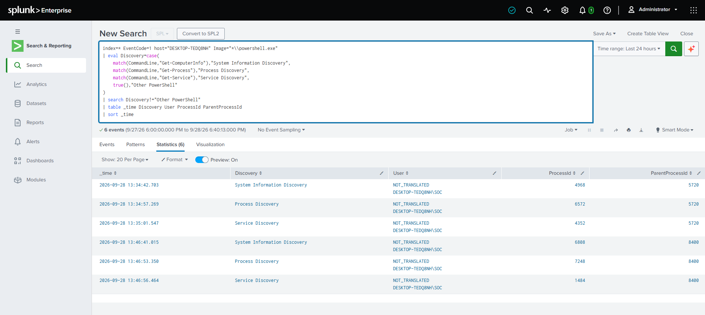

This identified six discovery events — 2× System Information Discovery, 2× Process Discovery, 2× Service Discovery — representing the two executions of the controlled simulator.

### 7. Discovery Summary

```spl
index=* EventCode=1 host="DESKTOP-TEDQ8NH" Image="*\\powershell.exe"
| eval Discovery=case(
    match(CommandLine,"Get-ComputerInfo"),"System Information",
    match(CommandLine,"Get-Process"),"Process Discovery",
    match(CommandLine,"Get-Service"),"Service Discovery",
    true(),"Other"
)
| search Discovery!="Other"
| stats count by Discovery
| sort - count
```

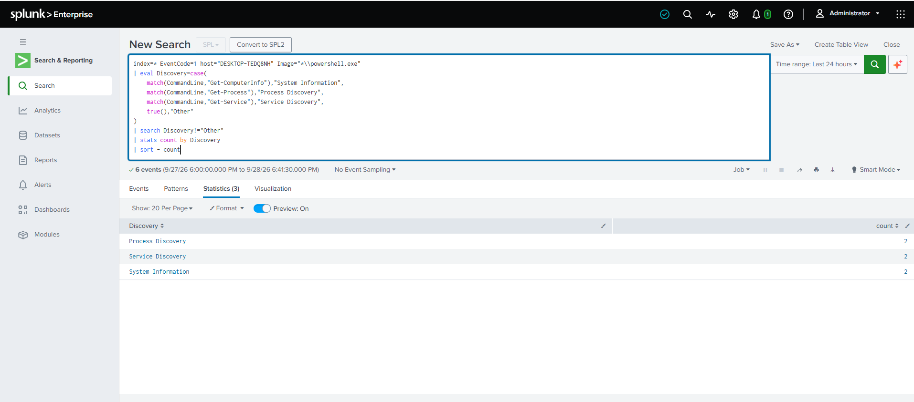

This converts individual process events into a concise detection summary.

### 8. Investigation Timeline

```spl
index=* EventCode=1 host="DESKTOP-TEDQ8NH"
| eval Activity=case(
    match(CommandLine,"-EncodedCommand"),"Encoded PowerShell",
    match(CommandLine,"Get-ComputerInfo"),"System Information Discovery",
    match(CommandLine,"Get-Process"),"Process Discovery",
    match(CommandLine,"Get-Service"),"Service Discovery",
    match(CommandLine,"Start-Process cmd.exe"),"PowerShell → cmd.exe",
    match(CommandLine,"Project02-Simulator.ps1"),"Simulator Execution",
    true(),"Other"
)
| search Activity!="Other"
| table _time Activity User ProcessId ParentProcessId
| sort _time
```

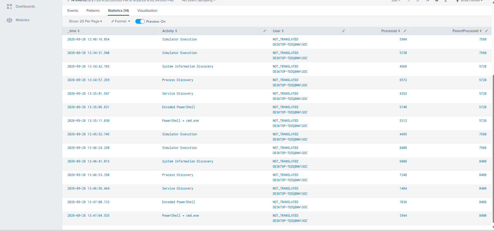

This query combined the relevant behaviors into a single chronological investigation view — 14 events across both simulator runs, from the initial `Simulator Execution` through discovery activity, the encoded command, and the PowerShell → `cmd.exe` handoff.

### 9. PowerShell → CMD Parent-Child Investigation

```spl
index=* EventCode=1 host="DESKTOP-TEDQ8NH"
| search Image="*\\cmd.exe"
| eval ParentProcess=replace(ParentImage,"^.*\\\\","")
| table _time User Image ProcessId ParentProcessId ParentProcess CommandLine
| sort _time
```

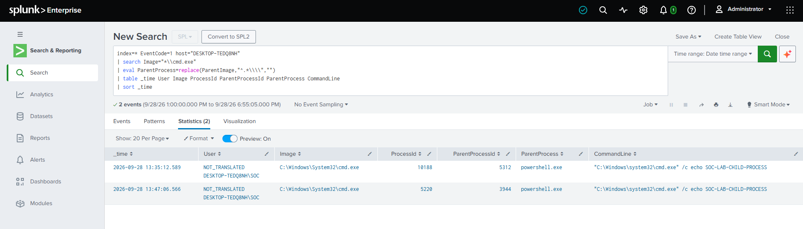

This was used to establish the process ancestry between PowerShell and `cmd.exe` — two events, one per simulator run, both showing `cmd.exe` spawned directly by `powershell.exe` with the command `/c echo SOC-LAB-CHILD-PROCESS`.

### 10. Additional Discovery Behavior

A broader review of every child process spawned under the simulator's session (rather than just the three commands the original discovery query targeted) surfaced activity the narrower query had missed:

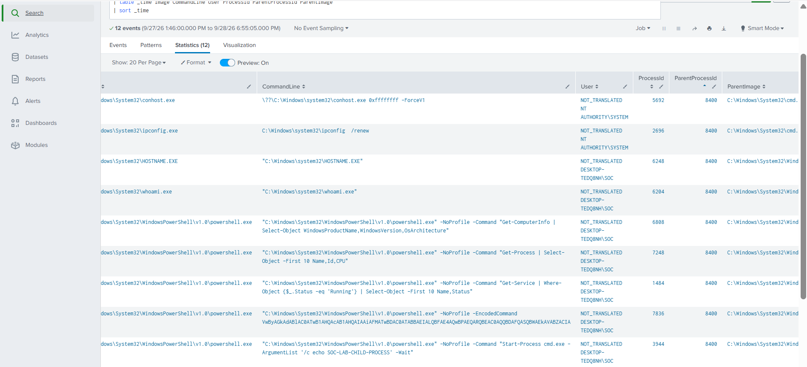

- `ipconfig /renew` — **Network Configuration Discovery**
- `whoami` — **System Owner/User Discovery**
- `hostname` — **System Information Discovery**
- `conhost.exe` — normal console-host process, not simulator-driven activity, excluded from detection logic

This is the same lesson as Project 01's repeated-message aggregation: a detection query is only as complete as the behaviors it was written to match, and it's worth periodically checking raw telemetry against the narrower, "finished" detections to catch what they miss.

### 11. Detection Summary

A refined version of the timeline query, built to summarize only the meaningful detection categories (excluding the simulator's own launch command, which is lab-harness noise rather than a detection-worthy signal):

```spl
index=* EventCode=1 host="DESKTOP-TEDQ8NH"
| eval Activity=case(
    match(CommandLine,"-EncodedCommand"),"Encoded PowerShell",
    match(CommandLine,"Get-ComputerInfo"),"System Information Discovery",
    match(CommandLine,"Get-Process"),"Process Discovery",
    match(CommandLine,"Get-Service"),"Service Discovery",
    match(CommandLine,"Start-Process cmd.exe"),"PowerShell spawning CMD",
    true(),"Other"
)
| search Activity!="Other"
| stats count by Activity
| sort - count
```

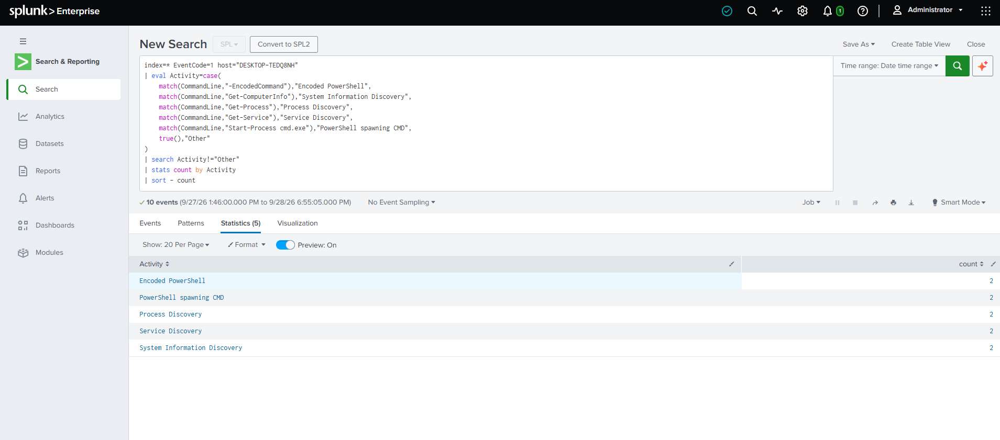

Five categories, two occurrences each (one per simulator run): Encoded PowerShell, PowerShell spawning CMD, Process Discovery, Service Discovery, System Information Discovery.

---

## Investigation Findings

1. Sysmon Event ID 1 telemetry from the Windows endpoint was successfully ingested into Splunk.
2. PowerShell activity was identified through process creation telemetry, starting from a raw, unfiltered view before building reusable classification queries.
3. The simulator was executed twice; every category of simulated activity appeared exactly twice, consistent with two full runs.
4. Two encoded PowerShell events were observed, both running under the lab user `DESKTOP-TEDQ8NH\SOC`, each a child of the PowerShell session that launched the simulator script.
5. PowerShell generated system information, process, service, network configuration, and user/host discovery activity — the last two were only found by reviewing the session's full child-process list, not the original three-category discovery query.
6. The simulator also generated a PowerShell → `cmd.exe` parent-child relationship, twice.
7. All observed events could be correlated through process IDs, parent process IDs, timestamps, and command-line data.
8. The Encoded PowerShell detection's `stats` grouping revealed a User-field inconsistency (`DESKTOP-TEDQ8NH\SOC` vs. `NOT_TRANSLATED`) that would double-count detections if not normalized before alerting.

---

## MITRE ATT&CK Mapping

| Observed behavior | MITRE ATT&CK |
|---|---|
| PowerShell execution | **T1059.001 — Command and Scripting Interpreter: PowerShell** |
| System information discovery (`Get-ComputerInfo`, `hostname`) | **T1082 — System Information Discovery** |
| Process discovery (`Get-Process`) | **T1057 — Process Discovery** |
| Service discovery (`Get-Service`) | **T1007 — System Service Discovery** |
| Network configuration discovery (`ipconfig /renew`) | **T1016 — System Network Configuration Discovery** |
| User/host discovery (`whoami`) | **T1033 — System Owner/User Discovery** |

The mapping reflects the behavior intentionally generated by the lab simulator. It does not establish that the activity was malicious.

---

## Screenshots

```text
screenshots/
├── 01a-sysmon-whoami-process.png
├── 01b-sysmon-whoami-parent-chain.png
├── 02a-sysmon-encoded-powershell-commandline.png
├── 02b-sysmon-encoded-powershell-parent-chain.png
├── 03-sysmon-powershell-spawning-cmd.png
├── 04-splunk-host-process-inventory.png
├── 05-splunk-powershell-raw-exploration.png
├── 06-splunk-powershell-activity-classification.png
├── 07-splunk-encoded-powershell-event-zoom.png
├── 08-splunk-encoded-powershell-detection.png
├── 09-splunk-powershell-discovery-detection.png
├── 10-splunk-discovery-summary.png
├── 11-splunk-investigation-timeline.png
├── 12-splunk-powershell-to-cmd-relationship.png
├── 13-splunk-additional-discovery-children.png
└── 14-splunk-detection-summary.png
```

Each screenshot provides supporting evidence for a specific stage of the investigation.

---

## Analyst Conclusion

The controlled investigation demonstrated that Sysmon process-creation telemetry can provide sufficient context to identify and investigate PowerShell activity in Splunk.

The most useful investigation signals were not individual keywords alone, but the combination of:

```text
Process + Command Line + Parent Process + User + Process ID + Parent Process ID + Timestamp
```

The exercise also reinforced two practical SOC lessons: first, that a detection built around a specific set of expected commands should periodically be checked against raw telemetry to catch behavior it wasn't written to match (here, `ipconfig`, `whoami`, and `hostname`); and second, that fields like `User` can be logged inconsistently across otherwise-identical events, which will silently inflate detection counts if not normalized.

---

## Skills Demonstrated

- Splunk Enterprise
- SPL
- Windows event analysis
- Sysmon
- PowerShell telemetry analysis
- Process ancestry analysis
- Command-line analysis
- Detection engineering
- Timeline reconstruction
- MITRE ATT&CK mapping
- SOC investigation methodology
