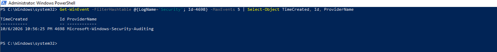
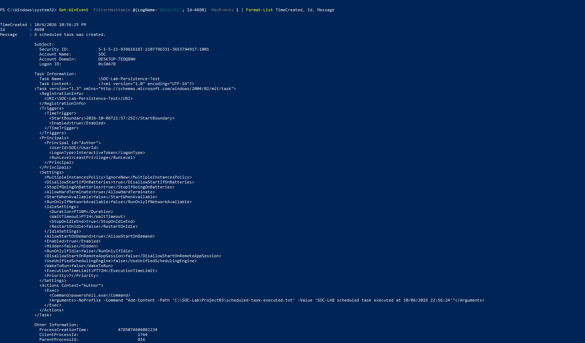
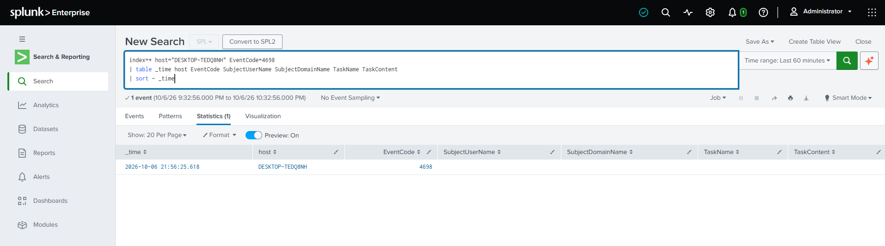
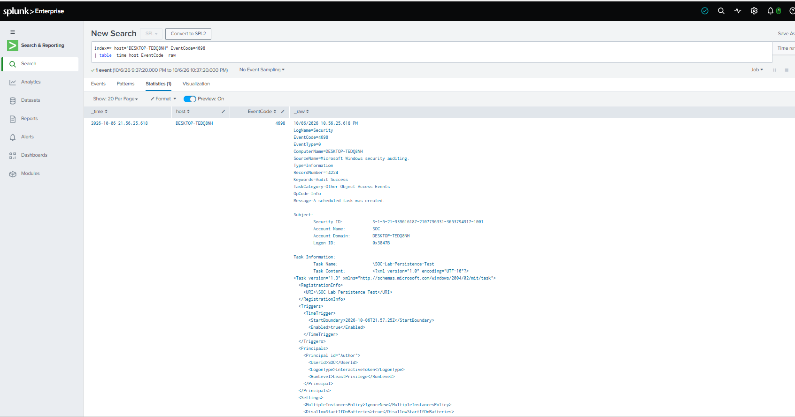
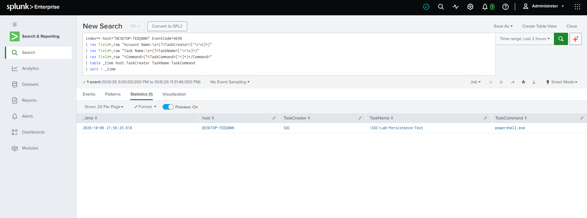
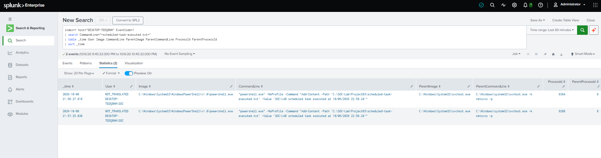
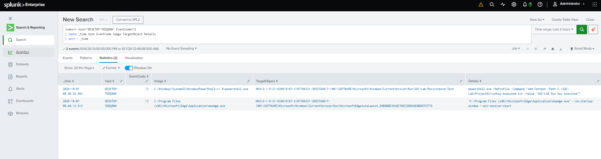
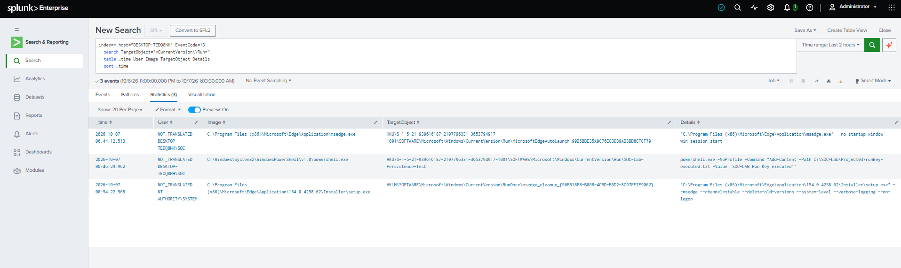
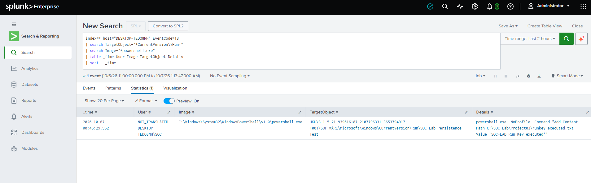
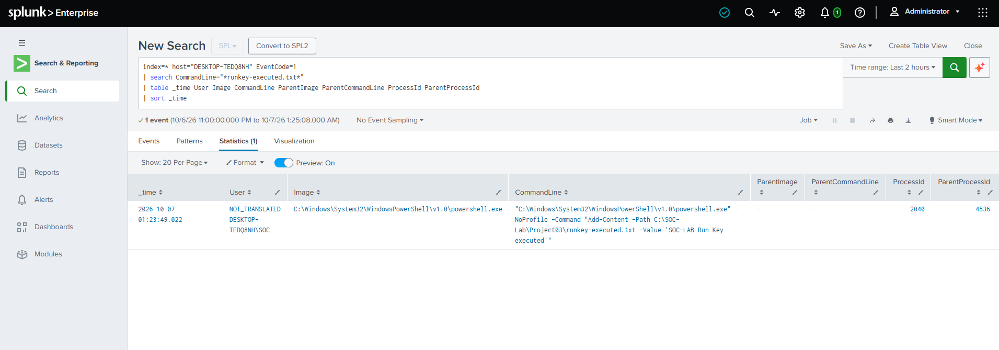

# Project 03 — Windows Persistence Investigation

## Overview

This project investigates Windows persistence mechanisms using **Splunk Enterprise**, Windows Security Event Logs, and **Sysmon** telemetry.

The investigation focuses on two common persistence techniques, each configured on the lab endpoint with a PowerShell payload:

1. Scheduled Task persistence
2. Registry Run Key persistence

The objective was to identify the persistence activity, investigate the process and account responsible, examine the configured payload, correlate the persistence mechanism with its subsequent execution, and map the activity to MITRE ATT&CK — while distinguishing the intentionally-configured persistence from legitimate background activity that happened to touch the same registry locations.

> **Lab note:** All activity in this project was intentionally generated inside an isolated cybersecurity lab, for detection and investigation practice.

---

## Investigation Objectives

- Detect the creation of a scheduled task.
- Identify the account responsible for creating the task.
- Examine the task configuration and execution payload.
- Correlate scheduled-task persistence with process execution telemetry.
- Detect modifications to Windows Registry Run Keys.
- Identify the process responsible for the registry modification — and rule out unrelated registry activity touching the same key.
- Examine the configured Run Key payload.
- Confirm execution of the persistence payload after logon.
- Map the observed techniques to MITRE ATT&CK.

---

## Lab Environment

| Component | Details |
|---|---|
| SIEM | Splunk Enterprise |
| Endpoint | Windows 10 |
| Host | `DESKTOP-TEDQ8NH` |
| User | `DESKTOP-TEDQ8NH\SOC` |
| Endpoint Telemetry | Sysmon |
| Windows Logs | Security Event Log |
| Network | Isolated SOC lab |
| Investigation Type | Host-based persistence detection |

---

# Investigation 1 — Scheduled Task Persistence

## Attack Scenario

A scheduled task was configured on the Windows endpoint with a PowerShell payload.

The investigation was performed from the perspective of a SOC analyst attempting to determine:

- Who created the task?
- What was the task called?
- What command would it execute?
- Did the configured payload subsequently execute?

---

## Source Validation

Before pivoting to Splunk, the Windows Security Event Log was checked directly on the endpoint via PowerShell, to confirm the event existed at the source:

```powershell
Get-WinEvent -FilterHashtable @{LogName='Security'; Id=4698} -MaxEvents 5 | Select-Object TimeCreated, Id, ProviderName
```



The full event was then reviewed to see the task configuration directly from the endpoint:

```powershell
Get-WinEvent -FilterHashtable @{LogName='Security'; Id=4698} -MaxEvents 1 | Format-List TimeCreated, Id, Message
```



This confirmed the task (`\SOC-Lab-Persistence-Test`) was created by account `SOC`, configured to run `powershell.exe` with a command writing a marker to `scheduled-task-executed.txt` — and gave the exact XML task definition to compare against what Splunk would later show.

---

## Detection

Windows Security Event ID **4698** was used to identify scheduled-task creation activity in Splunk.

### Splunk Query — initial attempt

```spl
index=* host="DESKTOP-TEDQ8NH" EventCode=4698
| table _time host EventCode SubjectUserName SubjectDomainName TaskName TaskContent
| sort - _time
```



The event was present, but `SubjectUserName`, `SubjectDomainName`, `TaskName`, and `TaskContent` all returned empty — these fields are not automatically extracted from this event type by default. The raw event was checked next to confirm the data had actually been ingested correctly:

```spl
index=* host="DESKTOP-TEDQ8NH" EventCode=4698
| table _time host EventCode _raw
| sort - _time
```



The `_raw` field confirmed the full event — including the task name and XML task content — had been ingested; it simply wasn't available as structured fields without extraction.

---

## Scheduled Task Analysis

`rex` was used to pull the relevant fields directly out of `_raw`:

### Splunk Query

```spl
index=* host="DESKTOP-TEDQ8NH" EventCode=4698
| rex field=_raw "Account Name:\s+(?<TaskCreator>[^\r\n]+)"
| rex field=_raw "Task Name:\s+(?<TaskName>[^\r\n]+)"
| rex field=_raw "<Command>(?<TaskCommand>[^<]+)</Command>"
| table _time host TaskCreator TaskName TaskCommand
| sort - _time
```

### Key Findings

| Field | Finding |
|---|---|
| Task Creator | `SOC` |
| Task Name | `\SOC-Lab-Persistence-Test` |
| Command | `powershell.exe` |
| Technique | Scheduled Task persistence |

### Evidence



---

## Execution Correlation

After identifying the scheduled task and its PowerShell payload, Sysmon Process Creation events were searched for evidence that the payload executed.

### Splunk Query

```spl
index=* host="DESKTOP-TEDQ8NH" EventCode=1
| search CommandLine="*scheduled-task-executed.txt*"
| table _time User Image CommandLine ParentImage ParentCommandLine ProcessId ParentProcessId
| sort _time
```



The task executed twice, both times as `powershell.exe` spawned by `svchost.exe -k netsvcs -p` — the Task Scheduler service host, which is the expected parent process for a scheduled task firing. This parent-process match is itself useful corroborating evidence: it confirms the execution genuinely came from the Task Scheduler mechanism rather than, for example, the user running the command manually.

---

## MITRE ATT&CK Mapping

**T1053.005 — Scheduled Task/Job: Scheduled Task**

The observed activity corresponds to the use of a Windows Scheduled Task as a persistence mechanism.

---

# Investigation 2 — Registry Run Key Persistence

## Attack Scenario

A Windows Registry Run Key was configured to execute a PowerShell command when the user logged on.

The investigation focused on identifying the registry modification, attributing the modification to the responsible process, examining the stored payload, and confirming execution after logon — and, as the investigation found, on correctly separating that one intentional entry from unrelated registry activity touching the same `Run`/`RunOnce` locations.

---

## Detection

Sysmon Event ID **13 — RegistryEvent (Value Set)** was used to identify modifications to the Windows Registry.

### Splunk Query

```spl
index=* host="DESKTOP-TEDQ8NH" EventCode=13
| table _time host EventCode Image TargetObject Details
| sort - _time
```



This confirmed registry value-set activity was being captured, including a modification under a `CurrentVersion\Run` key.

---

## Narrowing to Run/RunOnce Keys — and Finding Noise

The search was narrowed specifically to `Run`/`RunOnce` keys:

```spl
index=* host="DESKTOP-TEDQ8NH" EventCode=13
| search TargetObject="*CurrentVersion\\Run*"
| table _time User Image TargetObject Details
| sort - _time
```



This returned **three** events, not one:

| Time | Image | Target | Assessment |
|---|---|---|---|
| 00:44:12 | `msedge.exe` | `Run\MicrosoftEdgeAutoLaunch_...` | Benign — Edge's normal auto-launch registration |
| 00:46:29 | `powershell.exe` | `Run\SOC-Lab-Persistence-Test` | **The simulated persistence entry** |
| 00:54:22 | Edge installer `setup.exe` | `RunOnce\msedge_cleanup_...` | Benign — Edge's own update/cleanup task, run as `NT AUTHORITY\SYSTEM` |

Two of the three entries are ordinary browser-update housekeeping that happen to write to the same registry locations a persistence mechanism would use. This is a useful reminder that `Run`/`RunOnce` keys are high-traffic, legitimately-used locations — a detection built on "anything writes to `Run`" alone would fire on normal software update behavior and needs further narrowing before it's usable.

---

## Process Attribution

The investigation was narrowed further, to Run Key modifications performed specifically by PowerShell:

### Splunk Query

```spl
index=* host="DESKTOP-TEDQ8NH" EventCode=13
| search TargetObject="*CurrentVersion\\Run*"
| search Image="*powershell.exe"
| table _time User Image TargetObject Details
| sort _time
```

This isolated the one entry of interest, cleanly excluding both benign Edge events:

```text
C:\Windows\System32\WindowsPowerShell\v1.0\powershell.exe
```

The `TargetObject` identified the affected Registry Run Key, while the `Details` field exposed the configured PowerShell payload.

### Evidence



---

## Payload Execution

The endpoint was subsequently checked for Sysmon Process Creation telemetry associated with the configured Run Key payload.

### Splunk Query

```spl
index=* host="DESKTOP-TEDQ8NH" EventCode=1
| search CommandLine="*runkey-executed.txt*"
| table _time User Image CommandLine ParentImage ParentCommandLine ProcessId ParentProcessId
| sort _time
```



The resulting process creation event confirmed the PowerShell payload associated with the Registry Run Key executed after logon. `ParentImage` and `ParentCommandLine` were both empty for this event, unlike the scheduled task's execution evidence — the parent process in the Run Key's logon-triggered launch chain (typically `userinit.exe` or `explorer.exe`) was not captured or resolved in the available telemetry. The process ID and parent process ID (`2040` / `4536`) are recorded, but the ancestry could not be fully confirmed from this data alone; this is noted as a limitation of the evidence rather than treated as a resolved parent chain.

---

## MITRE ATT&CK Mapping

**T1547.001 — Registry Run Keys / Startup Folder**

The observed activity corresponds to the use of a Registry Run Key to establish persistence across user logons.

---

# Detection Summary

| Persistence Mechanism | Detection Source | Execution Evidence | Noise Encountered | MITRE ATT&CK |
|---|---|---|---|---|
| Scheduled Task | Windows Security Event ID 4698 | Sysmon Event ID 1 (parent: `svchost.exe`, confirmed) | None | T1053.005 |
| Registry Run Key | Sysmon Event ID 13 | Sysmon Event ID 1 (parent chain not resolved) | 2 benign Edge registry entries | T1547.001 |

---

# Analyst Takeaways

This investigation demonstrated how multiple Windows telemetry sources can be correlated in Splunk to identify persistence activity.

Key SOC investigation techniques demonstrated:

- Windows Security Event Log analysis
- Sysmon process creation analysis
- Sysmon registry monitoring
- Process attribution
- Persistence payload analysis
- Event correlation
- Splunk SPL investigation
- MITRE ATT&CK mapping

A few practical lessons stood out:

1. **Persistence detection should not rely on a single event.** Registry or scheduled-task modifications provide evidence of persistence *configuration*, while subsequent process creation telemetry establishes *execution* — the two together make a far stronger case than either alone.
2. **High-traffic registry locations generate legitimate noise.** The `Run`/`RunOnce` keys here picked up two unrelated, benign Edge browser events alongside the one real persistence entry — a reminder to verify what a detection actually isolates before trusting its output, not just what it's named for.
3. **Not every execution chain fully resolves**, and that's worth documenting honestly rather than assumed away — the Run Key's logon-triggered execution lacked a resolved parent process, while the scheduled task's `svchost.exe` parent was clean and corroborating.

---

# Screenshots

```text
screenshots/
├── 01-source-scheduled-task-event.png
├── 02-source-scheduled-task-details.png
├── 03-splunk-scheduled-task-fields-not-extracted.png
├── 04-splunk-scheduled-task-raw-event.png
├── 05-splunk-scheduled-task-extracted-fields.png
├── 06-splunk-scheduled-task-execution.png
├── 07-splunk-registry-run-key-unfiltered.png
├── 08-splunk-registry-run-key-noise.png
├── 09-splunk-registry-run-key-powershell-only.png
└── 10-splunk-registry-run-key-execution.png
```

---

# Skills Demonstrated

- Splunk Enterprise
- SPL
- Windows Event Log Analysis
- Sysmon
- Windows Persistence Detection
- Process Investigation
- Registry Analysis
- Scheduled Task Analysis
- Event Correlation
- Noise filtering / false-positive triage
- MITRE ATT&CK
- SOC Investigation Workflow
