# Lab Setup — Splunk SOC Environment

This documents the build and verification of the Splunk ingestion pipeline for the lab, before any investigation work began.

## Environment

| Role | Host | IP | Notes |
|---|---|---|---|
| Splunk Enterprise (indexer + search head) | Splunk-SOC VM | 192.168.56.105 | Ubuntu Server 24.04 LTS, 2 vCPU, 4 GB RAM, Enterprise Trial license |
| Linux telemetry source | Ubuntu | 192.168.56.102 | SSH, Apache, auth.log — forwards via Universal Forwarder |
| Windows telemetry source | Windows | 192.168.56.101 | Sysmon, Security/Application/System event logs, PowerShell — forwards via Universal Forwarder |
| Attacker | Kali | 192.168.56.103 | Powered on only when generating activity |
| Legacy SIEM | Wazuh | 192.168.56.104 | Kept off for this lab |

## 1. Configure Splunk to receive forwarded data

Before either endpoint can forward, the Splunk instance needs to listen for incoming forwarder connections.

1. Forwarding and Receiving page, before any receiver is configured.
   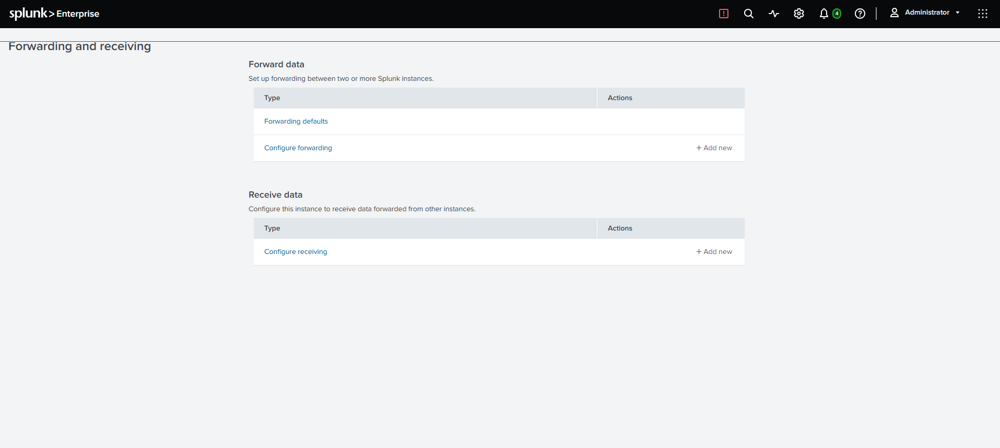
2. Configured to listen on TCP 9997, the standard Splunk forwarder-to-indexer port.
   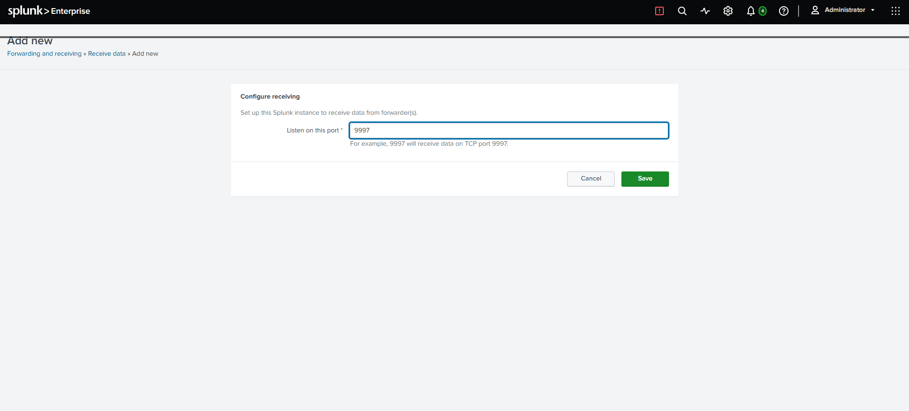
3. Confirmed on the Splunk server itself that `splunkd` is bound and listening on 9997.
   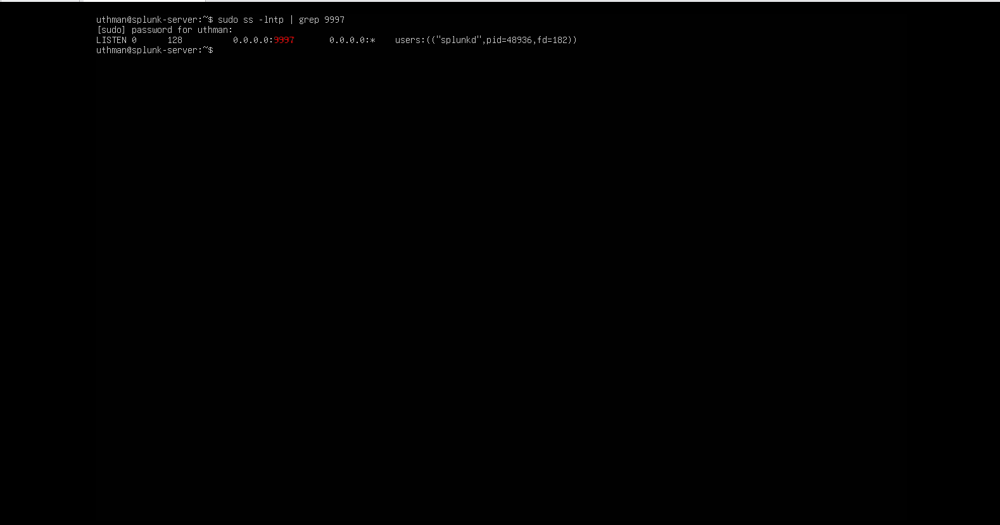

## 2. Ubuntu (.102) Universal Forwarder

1. Installed the Splunk Universal Forwarder and confirmed the service is running.
   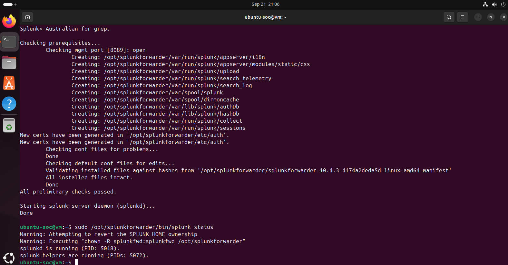
2. Verified network reachability from Ubuntu to the indexer on port 9997.
   
3. Confirmed events arriving in Splunk under `index=ubuntu` — `auth.log` entries via `sourcetype=linux_secure`.
   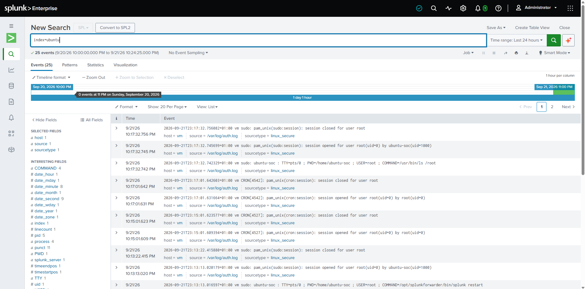
4. Narrowed the search to `sourcetype=linux_secure` to confirm ongoing, real-time ingestion.
   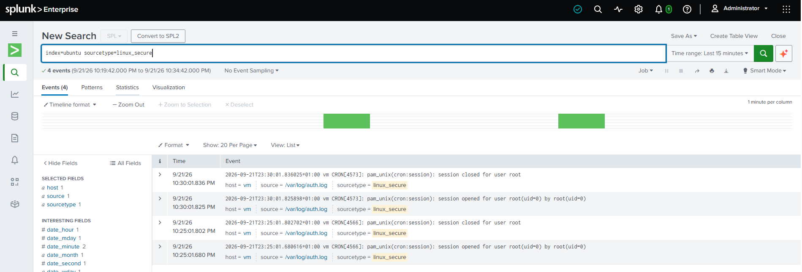

## 3. Windows (.101) Universal Forwarder

1. Verified network reachability to the indexer and confirmed an active forward-server entry.
   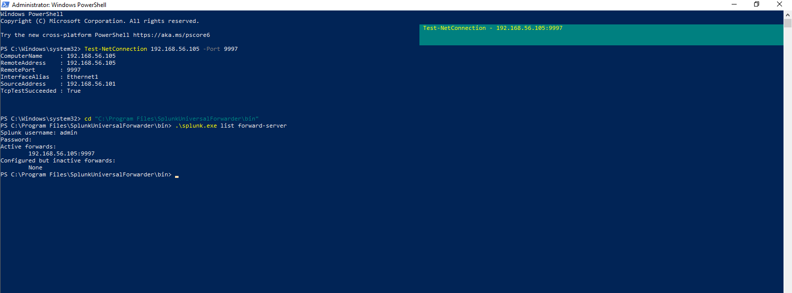
2. Edited `inputs.conf` to enable Application, Security, and System event logs plus the Sysmon operational log.
   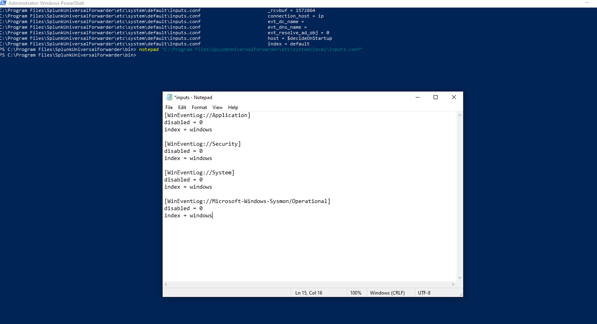
3. Used `btool` to confirm each input stanza was applied correctly:
   - Application log
     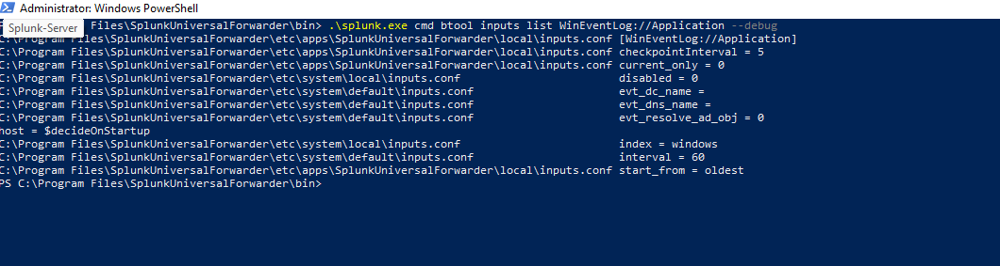
   - Security log
     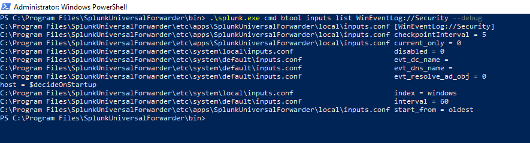
   - Sysmon operational log
     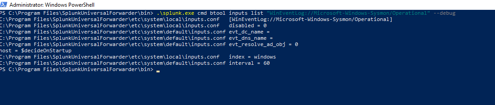
4. Confirmed Sysmon events arriving in Splunk under `index=windows` from `DESKTOP-TEDQ8NH`.
   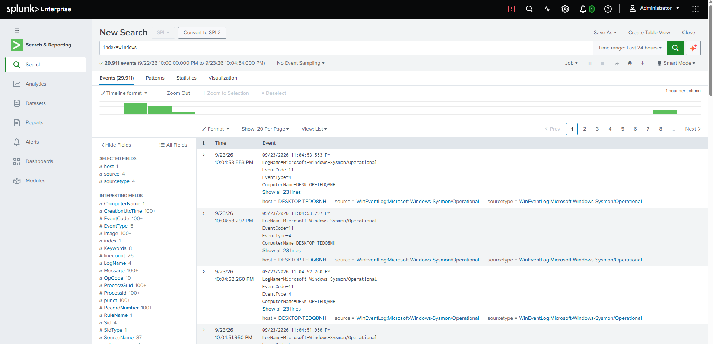

## Result

Both endpoints are forwarding to the Splunk indexer and their telemetry is confirmed searchable. Detection and investigation work for Projects 01–03 builds on this pipeline.
